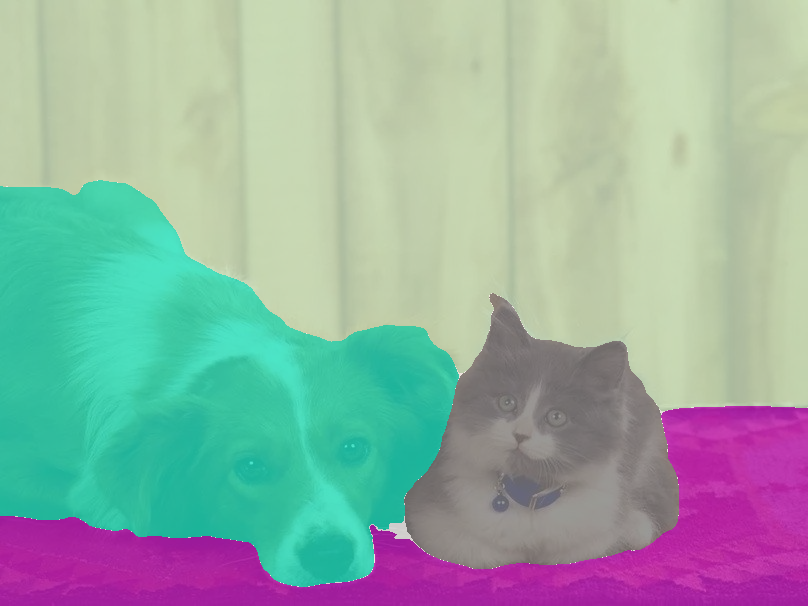
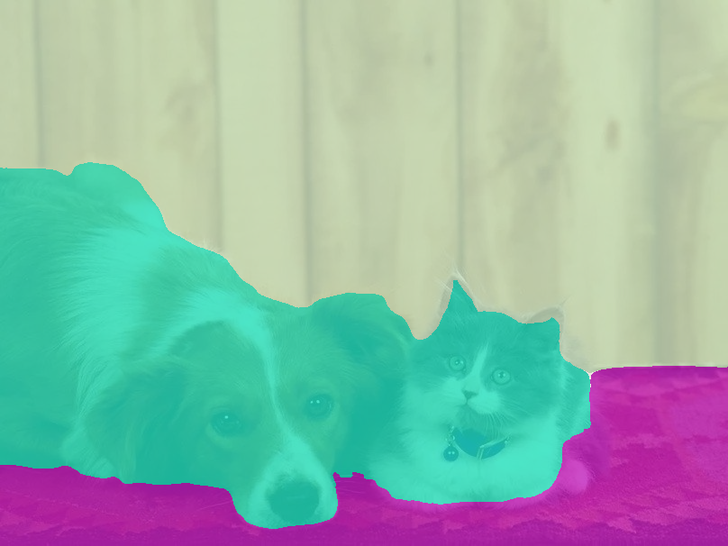

This repository contains the source code of our paper:
[Wei Yin, Yifan Liu, Chunhua Shen, Anton van den Hengel, Baichuan Sun, The devil is in the labels: Semantic segmentation from sentences](https://arxiv.org/abs/2202.02002)


Embedding: https://cloudstor.aarnet.edu.au/plus/s/gXaGsZyvoUwu97t
CKPT: https://cloudstor.aarnet.edu.au/plus/s/AtYYaVSVVAlEwve


## Define the label list
You can choose the label list used for semantic segmentation, for instance:
```python
python tools/test.py --config test_720_ss --user_label dog mouse horse rug_floormat wall person vegetation pizza
```
Here is the comparison between adding label "cat" or not:




## Define new labels
You can also define your own categories described by sentences, for instance:
```python
python tools/test.py --config test_720_ss --new_definitions="{'deer': 'This is an image of deer, similar to sheep or dog.'}"
```


This repository also contains the source code to fine-tune the model on the [CMP dataset](https://cmp.felk.cvut.cz/~tylecr1/facade/).


All the fine-tuning results and statistics are inlcuded in "Results.pdf".

The model was finetuned on the CMP base dataset with a train-test split of 80% and 20% respectively. The model was finetuned over 35 epochs with a very small learning rate. This report will contain the results of this finetuning and my thoughts on how to improve set results.


Below are some of the results (more can be found in "Results.pdf":


Possible Improvements:
  - we could increase the number of epochs; as we can see that the loss decreases and the segmentation becomes better as the number of epochs increases.
  - We could try going to 70 – 100 epochs. 
  - We could change the loss function. There are several loss functions that can be used in the segmentation problem, some of which could be found in this link: https://github.com/shruti-jadon/Semantic-Segmentation-Loss-Functions. Other loss functions could give us an improvement in performance. 
  - We could increase the dataset. We could add the extended dataset to the base one. 
 
Unfortunately, due to the time constraints, I was not able to try these improvements.
